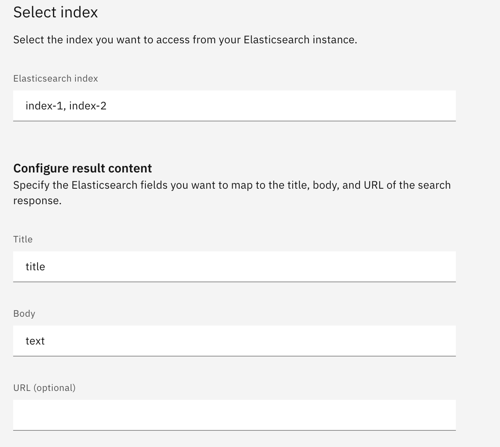

# Federated Search in Elasticsearch

This guide dives into performing a single search query across multiple indices within an Elasticsearch cluster. It assumes these indices share the same relevant fields for your search results.

## Methods for Multi-Index Search

There are several approaches to searching across multiple indices in Elasticsearch:

### 1. Comma-Separated Indices

This method involves listing all relevant indices separated by commas in the search URL. Here's an example using elser model for semantic search across `index-1` and `index-2`:

```bash
curl -X GET "${ES_URL}/index-1,index-2/_search?pretty" -u "${ES_USER}:${ES_PASSWORD}" \
-H "Content-Type: application/json" --cacert "${ES_CACERT}" -d'
{
   "query":{
      "text_expansion":{
         "ml.tokens":{
            "model_id":".elser_model_1",
            "model_text":"how to set up custom extension?"
         }
      }
   }
}'
```

### 2. Index Patterns

Index patterns allow you to target multiple indices using a wildcard pattern. Here's how to search across `index-1` and `index-2` using the same example:

```bash
curl -X GET "${ES_URL}/index-*/_search?pretty" -u "${ES_USER}:${ES_PASSWORD}" \
-H "Content-Type: application/json" --cacert "${ES_CACERT}" -d'
{
   "query":{
      "text_expansion":{
         "ml.tokens":{
            "model_id":".elser_model_1",
            "model_text":"how to set up custom extension?"
         }
      }
   }
}'
```

### 3. Aliases
You can create an alias that represents multiple indices, and then search against that alias. This allows you to dynamically change which indices are included in the search without modifying the search query.

```bash
curl -X POST "${ES_URL}/_aliases" -u "${ES_USER}:${ES_PASSWORD}" \
-H "Content-Type: application/json" --cacert "${ES_CACERT}" -d'
{
  "actions": [
    { "add": { "index": "index-1", "alias": "alias-1" }},
    { "add": { "index": "index-2", "alias": "alias-1" }}
  ]
}'
```

You can then search against the `alias-1` alias, which includes both `index-1` and `index-2`:

```bash
curl -X GET "${ES_URL}/alias-1/_search?pretty" -u "${ES_USER}:${ES_PASSWORD}" \
-H "Content-Type: application/json" --cacert "${ES_CACERT}" -d'
{
   "query":{
      "text_expansion":{
         "ml.tokens":{
            "model_id":".elser_model_1",
            "model_text":"how to set up custom extension?"
         }
      }
   }
}'
```

### 4. Searching All Indices

To search across all indices in the cluster, you can omit the index name entirely or use `_all` or `*`:

```bash
# Omit index name
curl -X GET "${ES_URL}/_search?pretty" -u "${ES_USER}:${ES_PASSWORD}" \
-H "Content-Type: application/json" --cacert "${ES_CACERT}" -d'
{
   "query":{
      "text_expansion":{
         "ml.tokens":{
            "model_id":".elser_model_1",
            "model_text":"how to set up custom extension?"
         }
      }
   }
}'

# Using _all
curl -X GET "${ES_URL}/_all_/_search?pretty" -u "${ES_USER}:${ES_PASSWORD}" \
-H "Content-Type: application/json" --cacert "${ES_CACERT}" -d'
{
   "query":{
      "text_expansion":{
         "ml.tokens":{
            "model_id":".elser_model_1",
            "model_text":"how to set up custom extension?"
         }
      }
   }
}'

# Using *
curl -X GET "${ES_URL}/*/_search?pretty" -u "${ES_USER}:${ES_PASSWORD}" \
-H "Content-Type: application/json" --cacert "${ES_CACERT}" -d'
{
   "query":{
      "text_expansion":{
         "ml.tokens":{
            "model_id":".elser_model_1",
            "model_text":"how to set up custom extension?"
         }
      }
   }
}'
```

## Using these Methods with Agent Knowledge in watsonx Orchestrate

For similar functionality with watsonx Orchestrate's Agent Knowledge, follow the documentation for [Connecting to an Elasticsearch content repository](https://www.ibm.com/docs/en/watsonx/watson-orchestrate/base?topic=agents-connecting-elasticsearch-content-repository). The key difference is specifying your `Elasticsearch index` field using one of the methods described above. For example:


