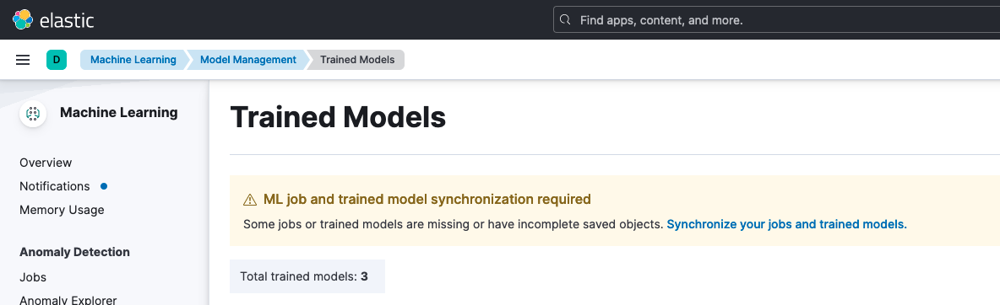

# How to set up and use third party text embeddings for dense vector search in Elasticsearch
This guide outlines the deployment and usage of a text embedding model within Elasticsearch. The model generates vector representations for text, enabling k-nearest neighbors (KNN) search based on vector similarity.

## Set up Elasticsearch

### Set up Elasticsearch on IBM Cloud
If you are using Elasticsearch from IBM Cloud, refer to [Install guide](./ICD_Elasticsearch_install_and_setup.md) to create an Elasticsearch instance and set up Kibana.

### Set up Elasticsearch on IBM CloudPak for Data
If you want to set up Elasticsearch on Kubernetes (ECK) on CloudPak for Data, refer to [Install guide](./watsonx_discovery_install_and_setup.md) to set up Elasticsearch and Kibana. You can skip [Enable ELSER model (v2)](./watsonx_discovery_install_and_setup.md#enable-elser-model-v2) and other following sections in the guide.

## Install the eland library
Run the following command to install the [eland](https://github.com/elastic/eland) library.
```bash
python -m pip install "eland[pytorch]"
```
This library enables the retrieval and deployment of a third-party text embedding model to your Elasticsearch instance.

**RESTRICTION**:
Open-source and third-party models are not covered under IBM or Elastic's indemnification policies. Customers must review and accept the applicable terms and conditions when selecting or integrating their own models. Additionally, IBM has not evaluated Elastic-supported multilingual models. Hence, you must thoroughly understand both the usage terms of these models and the licensing and data policies associated with the datasets.

NOTE:
* At the time of writing, the eland library supports only Python versions 3.8, 3.9, and 3.10. Refer to the eland library [compatibility section](https://github.com/elastic/eland?tab=readme-ov-file#compatibility) to ensure your Python and Elasticsearch versions are compatible.
* If you run into compatibility issues during installation, try to specify a version of `eland[pytorch]` that is compatible with your Elasticsearch version.

NOTE: You can also use eland without installing the library in case you run into any issues with the library. This can be done by using the [Docker image](https://github.com/elastic/eland?tab=readme-ov-file#docker).

## Create environment variables for ES credentials
Customize the names of the `ES_SOURCE_INDEX_NAME`, `ES_EMBEDDING_INDEX_NAME` and `ES_PIPELINE_NAME` variables. These names serve as references for your source index, embedding index, and ingestion pipeline throughout this guide.
  ```bash
  export ES_URL=https://<hostname:port>
  export ES_USER=<username>
  export ES_PASSWORD=<password>
  export ES_CACERT=<path-to-your-cert>
  export ES_SOURCE_INDEX_NAME=<name-of-source-index>
  export ES_EMBEDDING_INDEX_NAME=<name-of-embedding-index>
  export ES_PIPELINE_NAME=<name-of-ingest-pipeline>
  ```  
You can find the credentials from the service credentials of your Elasticsearch instance.
## Pull and deploy an embedding model
Run the following command to pull your desired model from the [Huggingface Models Hub](https://huggingface.co/models) and deploy it on your Elasticsearch instance:
```bash
eland_import_hub_model \
  --url $ES_URL \
  -u $ES_USER -p $ES_PASSWORD --insecure \
  --hub-model-id intfloat/multilingual-e5-small \
  --task-type text_embedding \
  --start
```

In the above example, `multilingual-e5-small` model which is a multi-lingual model that supports text embeddings in 100 languages is taken for reference. For more information on this model, see [Multilingual-E5-small](https://huggingface.co/intfloat/multilingual-e5-small).

## Synchronize your deployed model
To synchronize your deployed model:
1. Go to  http://localhost:5601/app/ml/trained_models page.
2. Click **Machine Learning** > **Trained Models**.
3. A warning message, "ML job and trained model synchronization required" is displayed at the top of the page.
4. Click the link "Synchronize your jobs and trained models".
5. Click **Synchronize**.



Once you synchronize your model you should see your deployed model on the **Machine Learning > Model Management** page in Kibana.


## Test your deployed model
Run the command below to test the model using the _infer API
```bash
curl -X POST "${ES_URL}/_ml/trained_models/intfloat__multilingual-e5-small/_infer" -u "${ES_USER}:${ES_PASSWORD}" -H "Content-Type: application/json" --cacert $ES_CACERT -d '{
  "docs": {
    "text_field": "how to set up custom extension?"
  }
}'
```
You should see a response containing the predicted embedding vector.

```bash
{
  "inference_results": [
    {
      "predicted_value": [
        0.016921168193221092,
        -0.035475824028253555,
        -0.0497407428920269,
        ...
```

## Load sample data
Refer to the [Load data into Elasticsearch](./ICD_Elasticsearch_install_and_setup.md#load-data-into-elasticsearch) section in the Elasticsearch setup guide to upload a sample data to Elasticsearch using Kabana.

## Add your embedding model to an inference ingest pipeline
Create an ingest pipeline using the command below:
```bash
curl -X PUT "${ES_URL}/_ingest/pipeline/${ES_PIPELINE_NAME}" \
  -u "${ES_USER}:${ES_PASSWORD}" --cacert "${ES_CACERT}"\
  -H 'Content-Type: application/json' -d '{
  "description": "Text embedding pipeline",
  "processors": [
    {
      "inference": {
        "model_id": "intfloat__multilingual-e5-small",
        "target_field": "text_embedding",
        "field_map": {
          "text": "text_field"
        }
      }
    }
  ],
  "on_failure": [
    {
      "set": {
        "description": "Index document to '\''failed-<index>'\''",
        "field": "_index",
        "value": "failed-{{{_index}}}"
      }
    },
    {
      "set": {
        "description": "Set error message",
        "field": "ingest.failure",
        "value": "{{_ingest.on_failure_message}}"
      }
    }
  ]
}'
```

Go to http://localhost:5601/app/management/ingest/ingest_pipelines page and verify that the ingest pipeline was created by locating it in the list of your ingest pipelines on Kibana.

## Create a mapping for the destination index containing the embeddings
Then run the command below to create the mappings of the destination index called `ES_EMBEDDING_INDEX_NAME`:
```bash
curl -X PUT "${ES_URL}/${ES_EMBEDDING_INDEX_NAME}" \
  -u "${ES_USER}:${ES_PASSWORD}" --cacert $ES_CACERT \
  -H 'Content-Type: application/json' -d '{
  "mappings": {
    "properties": {
      "text_embedding.predicted_value": {
        "type": "dense_vector",
        "dims": 384,
        "index": true,
        "similarity": "cosine"
      },
      "text": {
        "type": "text"
      }
    }
  }
}'
```

* `text_embedding.predicted_value` is the field where the ingest processor stores the embeddings
* `dims` is the embedding size of the deployed model which is 384 for the `intfloat/multilingual-e5-small` model we are using here

## Create the text embeddings
Run the ingest pipeline to reindex the data to the `ES_EMBEDDING_INDEX_NAME` index
```bash
curl -X POST "${ES_URL}/_reindex?wait_for_completion=false" \
  -u "${ES_USER}:${ES_PASSWORD}" --cacert "$ES_CACERT" \
  -H 'Content-Type: application/json' -d "{
  \"source\": {
    \"index\": \"${ES_SOURCE_INDEX_NAME}\",
    \"size\": 50
  },
  \"dest\": {
    \"index\": \"${ES_EMBEDDING_INDEX_NAME}\",
    \"pipeline\": \"${ES_PIPELINE_NAME}\"
  }
}"
```

This command will return a task id that looks like this:
```json
{"task":<task-id>}
```

The reindexing process can take around 10 minutes. You can use the task id that is returned above to check the status of the process.

```bash
curl -X GET "${ES_URL}/_tasks/<task-id>" \
  -u "${ES_USER}:${ES_PASSWORD}" --cacert $ES_CACERT
```

You can check the completion status by monitoring the `"completed"` field in the response:

```bash
{
  "completed": true,
  ...
}
```

Once the process is completed, you should see `ES_EMBEDDING_INDEX_NAME` in the list of your indices http://localhost:5601/app/enterprise_search/content/search_indices

You can confirm the successful completion of this step by checking the `ES_EMBEDDING_INDEX_NAME` index. If you find the `text_embedding` column filled with embedding vectors as shown below, it indicates that the process was successful:
```bash
{
  "predicted_value": [
    -0.016909973695874214,
    -0.05246243625879288,
    -0.02864678204059601,
    ...
  ],
  "model_id": "intfloat__multilingual-e5-small"
}
```
## Run semantic search
After the dataset has been enriched with vector embeddings, you can query the data using semantic search. 
```bash
curl -X GET "${ES_URL}/${ES_EMBEDDING_INDEX_NAME}/_search" \
  -u "${ES_USER}:${ES_PASSWORD}" --cacert $ES_CACERT \
  -H 'Content-Type: application/json' -d '{
  "knn": {
    "field": "text_embedding.predicted_value",
    "query_vector_builder": {
      "text_embedding": {
        "model_id": "intfloat__multilingual-e5-small",
        "model_text": "how to set up custom extension?"
      }
    },
    "k": 10,
    "num_candidates": 100
  },
  "_source": [
    "id",
    "text"
  ]
}'
```

## What to do next
Now that you've successfully deployed your text embedding model in Elasticsearch, see [Elasticsearch integration with Agent Knowledge in watsonx Orchestrate](README.md#elasticsearch-integration-with-agent-knowledge-in-watsonx-orchestrate) to set up Agent Knowledge using your Elasticsearch index.

Here is an example Elasticsearch query body:
```
{
  "knn": {
    "field": "text_embedding.predicted_value",
    "query_vector_builder": {
      "text_embedding": {
        "model_id": "intfloat__multilingual-e5-small",
        "model_text": "$QUERY"
      }
    },
    "k": 10,
    "num_candidates": 100
  },
  "_source": [
    "id",
    "text"
  ]
}
```
