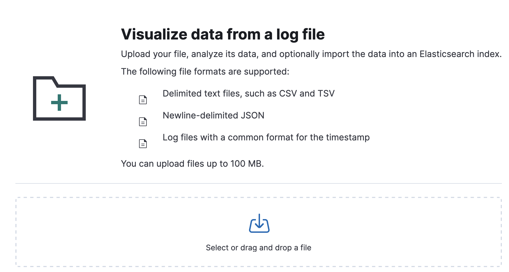
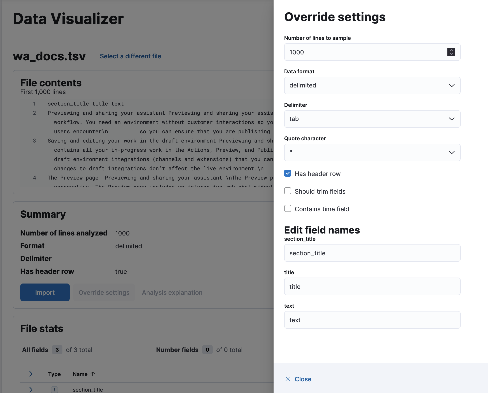
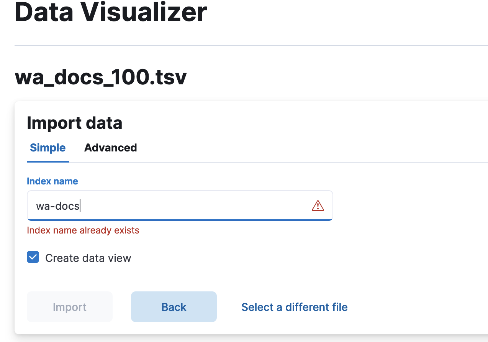

# How to set up watsonx Discovery (Elasticsearch) and integrate it with watsonx Orchestrate in CloudPak
This is a documentation about how to set up watsonx Discovery (aka Elasticsearch on-prem) and integrate it with watsonx Orchestrate in CloudPak.

## Table of contents:
* [Step 1: Install Elastic Cloud on Kubernetes(ECK) on CloudPak](#step-1-install-elastic-cloud-on-kubernetes-eck-in-cloudpak)
* [Step 2: Enable semantic search with ELSER in Elasticsearch](#step-2-enable-semantic-search-with-elser-in-elasticsearch)


## Step 1: Install Elastic Cloud on Kubernetes(ECK) on CloudPak
This step is about installing Elastic Cloud on Kubernetes (ECK) in CloudPak. 

Before you begin, you will need:
* Access to a CloudPak cluster
* An ECK Enterprise orchestration license

### Log in to your CloudPak cluster
* Log in to your Redhat OpenShift console using your admin credentials.
* Find your login API token by clicking on `Copy login command` from the top right dropdown menu.
* After displaying the token, copy the `Log in with this token` command, and run it from your terminal window.  
  NOTE: If you don't have the OpenShift CLI (`oc`) installed, you can find the instructions to install it by clicking on 
  the `Command line tools` from the top right :grey_question: dropdown menu.
* If you see logs like below, you have successfully logged into your CloudPak cluster
  ```
  Logged into "https://api.wa24.cp.fyre.ibm.com:6443" as "kube:admin" using the token provided.

  You have access to 78 projects, the list has been suppressed. You can list all projects with 'oc projects'

  Using project "default".
  ```

### Install ECK with Elasticsearch cluster and Kibana
* Create environment variables for the installation, for example, 
  ```shell
  export ES_NAMESPACE="elastic"
  export STORAGECLASS="ocs-storagecluster-ceph-rbd"
  export ES_CLUSTER="wxd"
  ```
  NOTE: you need to find a valid StorageClass name. `oc get sc` will show you all the StorageClass objects.
* Create a new namespace for ECK installation
  ```shell
  oc create ns ${ES_NAMESPACE}
  ```
* Create ECK crds
  ```shell
  oc create -f https://download.elastic.co/downloads/eck/2.9.0/crds.yaml
  ```
  NOTE: `2.9.0` is the latest supported version by watsonx Discovery
* Create ECK operator in a different namespace `elastic-system`
  ```shell
  oc apply -f https://download.elastic.co/downloads/eck/2.9.0/operator.yaml
  ```
* Create a Elasticsearch cluster
  ```shell
  cat <<EOF |oc apply -f -
  apiVersion: elasticsearch.k8s.elastic.co/v1
  kind: Elasticsearch
  metadata:
    name: ${ES_CLUSTER}
    namespace: ${ES_NAMESPACE}
  spec:
    volumeClaimDeletePolicy: DeleteOnScaledownOnly
    version: 8.11.1
    nodeSets:
      - name: default
        count: 3
        volumeClaimTemplates:
          - metadata:
              name: elasticsearch-data # Do not change this name unless you set up a volume mount for the data path.
            spec:
              accessModes:
                - ReadWriteOnce
              resources:
                requests:
                  storage: 50Gi
              storageClassName: ${STORAGECLASS}
        podTemplate:
          spec:
            containers:
              - name: elasticsearch
                resources:
                  requests:
                    memory: 8Gi
                    cpu: 2
                  limits:
                    cpu: 8
                    memory: 8Gi
  EOF
  ```  
  NOTE: Learn more about configuring compute resources from [here](https://www.elastic.co/guide/en/cloud-on-k8s/2.9/k8s-managing-compute-resources.html).
  * Monitor Elasticsearch health and creation progress
    ```shell
    oc get Elasticsearch -n ${ES_NAMESPACE}
    ```
  * Check that the Elasticsearch pods are running 
    ```shell
    oc get pods -n ${ES_NAMESPACE}
    ```

* Create a Kibana instance and associate it with your Elasticsearch cluster
  ```shell
  cat <<EOF |oc apply -f -
  apiVersion: kibana.k8s.elastic.co/v1
  kind: Kibana
  metadata:
    name: ${ES_CLUSTER}
    namespace: ${ES_NAMESPACE}
  spec:
    version: 8.11.1
    count: 3
    elasticsearchRef:
      name: ${ES_CLUSTER}
    podTemplate:
      spec:
        containers:
        - name: kibana
          env:
            - name: NODE_OPTIONS
              value: "--max-old-space-size=2048"
          resources:
            requests:
              memory: 1Gi
              cpu: 0.5
            limits:
              memory: 2.5Gi
              cpu: 2
  EOF
  ```  
  NOTE: the container resources are configurable.
  * Monitor Kibana health and creation progress
    ```shell
    oc get kibana -n ${ES_NAMESPACE}
    ```
  * A ClusterIP Service is automatically created for Kibana, check it by:
    ```shell
    oc get service ${ES_CLUSTER}-kb-http -n ${ES_NAMESPACE} 
    ```

* Add an ECK enterprise license  
  When you install the default distribution of ECK, you receive a Basic license. If you have a valid Enterprise 
  subscription or a trial license extension, you will receive a link to download a license as a JSON file. You can then
  add the license to your ECK installation. 
  ```shell
  oc create secret generic eck-license --from-file=my-license-file.json -n elastic-system
  oc label secret eck-license "license.k8s.elastic.co/scope"=operator -n elastic-system
  ```
  NOTE: Replace `my-license-file.json` with the JSON file you have downloaded. Learn more about adding a ECK license [here](https://www.elastic.co/guide/en/cloud-on-k8s/current/k8s-licensing.html#k8s-add-license).

### Verify the installation 
* Obtain the Elasticsearch credentials
  * The default username is `elastic`
  * The password can be obtained by the following command:
    ```shell
    oc get secret ${ES_CLUSTER}-es-elastic-user -o=jsonpath='{.data.elastic}' -n ${ES_NAMESPACE}| base64 --decode; echo
    ```
* Use `port-forward` to access Kibana locally:
  ```shell
  oc port-forward service/${ES_CLUSTER}-kb-http 5601 -n ${ES_NAMESPACE}
  ```
* Open https://localhost:5601 in browser, and login using the Elasticsearch credentials. 
  If you can successfully log into Kibana and see the Kibana dashboard without any errors, your ECK installation is successful.

## Step 2: Enable semantic search with ELSER in Elasticsearch
This step is to enable semantic search using ELSER. Here are the tutorials from Elasticsearch doc:  
ELSER v1: https://www.elastic.co/guide/en/elasticsearch/reference/8.10/semantic-search-elser.html  
ELSER v2: https://www.elastic.co/guide/en/elasticsearch/reference/8.11/semantic-search-elser.html

Note: ELSER v2 has become available since Elasticsearch 8.11. It is preferred to use ELSER v2 if it is available.

The following steps are based on ELSER v2 model:
### Use port-forward to access Elasticsearch cluster locally
In a new terminal window with `ES_CLUSTER` and `ES_NAMESPACE` available as environment variables, run the following 
command to make the Elasticsearch cluster accessible on your local machine.
  ```shell
  oc port-forward service/${ES_CLUSTER}-es-http 9200 -n ${ES_NAMESPACE}
  ```

### Create environment variables for Elasticsearch credentials
In a new terminal window with `ES_CLUSTER` and `ES_NAMESPACE` available as environment variables, follow the following 
steps to create environment variables for later use.  
* Download TLS certificate and create an environment variable for it
  ```shell
  oc -n ${ES_NAMESPACE} get secret "${ES_CLUSTER}-es-http-certs-public" -o go-template='{{index .data "tls.crt" | base64 --decode }}' > tls.crt
  
  export ES_CACERT="tls.crt"
  ```
  NOTE: you can skip the cert if you are okay with insecure connections. Instead of providing `--cacert` to your curl commands, 
  you can use `-k` or `--insecure` for insecure connections.
* Create other environment variables for Elasticsearch credentials
  ```shell
  export ES_URL=https://localhost:9200
  export ES_USER=<username>
  export ES_PASSWORD=<password>
  ```
  You have obtained `ES_USER` and `ES_PASSWORD` from [obtain-the-elasticsearch-credentials](#verify-the-installation) step.

### Enable ELSER model (v2)
ELSER model is not enabled by default, but you can enable it in Kibana. Please follow the [download-deploy-elser instructions](https://www.elastic.co/guide/en/machine-learning/8.11/ml-nlp-elser.html#download-deploy-elser) to do it.

Note: `.elser_model_2_linux-x86_64` is an optimized version of the ELSER v2 model and is preferred to use if it is available. Learn more about [inference-ingest-pipeline](https://www.elastic.co/guide/en/elasticsearch/reference/8.11/semantic-search-elser.html#inference-ingest-pipeline) from the tutorial.

### Load data into Elasticsearch
In Kibana, you can upload a data file to Elasticsearch cluster using the Data Visualizer in the Machine Learning UI https://localhost:5601/app/ml/filedatavisualizer.
(You need to use `port-forward` to allow local access to Kibana service and login using Elasticsearch credentials as described in
[verify-the-installation](#verify-the-installation) step)

As an example, you can download [wa-docs-100](./assets/wa_docs_100.tsv) TSV data and upload it to Elasticsearch.
This dataset contains documents processed from the watsonx Assistant product documents. There are three columns in this TSV file,
`title`, `section_title` and `text`. The columns are extracted from the original documents. Specifically,
each `text` value is a small chunk of text split from the original document.

In Kibana,
* Select your downloaded file to upload  
  
* Click `Override settings` and then check `Has header row` checkbox because the example dataset has header row  
  
* Import the data to a new Elasticsearch index and name it `wa-docs`  
    
  Once finished, you have created an index for the data you just uploaded.

### Create an index with mappings for ELSER output
  ```bash
  curl -X PUT "${ES_URL}/search-wa-docs?pretty" -u "${ES_USER}:${ES_PASSWORD}" \
  -H "Content-Type: application/json" --cacert "${ES_CACERT}" -d'
  {
    "mappings": {
      "_source": {
          "excludes": [
            "text_embedding"
          ]
      },
      "properties": {
        "text_embedding": {
          "type": "sparse_vector"
        },
        "text": {
          "type": "text"
        }
      }
    }
  }'
  ```
Notes:
* `search-wa-docs` will be your index name
* `text_embedding` is the field that will keep ELSER output when data is ingested, and `sparse_vector` type is required for ELSER output field
* `text` is the input filed for the inference processor. In the example dataset, the name of the input field is `text` which will be used by ELSER model to process.
* Learn more about [elser-mappings](https://www.elastic.co/guide/en/elasticsearch/reference/8.11/semantic-search-elser.html#elser-mappings) from the tutorial

### Create an ingest pipeline with an inference processor
Create an ingest pipeline with an inference processor to use ELSER to infer against the data that will be ingested in the pipeline.
  ```bash
  curl -X PUT "${ES_URL}/_ingest/pipeline/elser-v2-test?pretty" -u "${ES_USER}:${ES_PASSWORD}" \
  -H "Content-Type: application/json" --cacert "${ES_CACERT}" -d'
  {
    "processors": [
      {
        "inference": {
          "model_id": ".elser_model_2_linux-x86_64",
          "input_output": [
            {
              "input_field": "text",
              "output_field": "text_embedding"
            }
          ]
        }
      }
    ]
  }'
  ```
Note: `.elser_model_2_linux-x86_64` is an optimized version of the ELSER v2 model and is preferred to use if it is available. Learn more about [inference-ingest-pipeline](https://www.elastic.co/guide/en/elasticsearch/reference/8.11/semantic-search-elser.html#inference-ingest-pipeline) from the tutorial.

### Ingest the data through the inference ingest pipeline
Create the tokens from the text by reindexing the data through the inference pipeline that uses ELSER as the inference model.
  ```bash
  curl -X POST "${ES_URL}/_reindex?wait_for_completion=false&pretty" -u "${ES_USER}:${ES_PASSWORD}" \
  -H "Content-Type: application/json" --cacert "${ES_CACERT}" -d'
  {
    "source": {
      "index": "wa-docs"
    },
    "dest": {
      "index": "search-wa-docs",
      "pipeline": "elser-v2-test"
    }
  }'
  ```
* `wa-docs` is the index you created when uploading the example file to Elasticsearch cluster. It contains the text data
* `search_wa-docs` is the search index that has ELSER output field
* `elser-v2-test` is the ingest pipeline with an inference processor using ELSER model

### Semantic search by using the text_expansion query
To perform semantic search, use the `text_expansion` query, and provide the query text and the ELSER model ID.
The example below uses the query text "How to set up custom extension?", the `text_embedding` field contains
the generated ELSER output:
  ```bash
  curl -X GET "${ES_URL}/search-wa-docs/_search?pretty" -u "${ES_USER}:${ES_PASSWORD}" \
  -H "Content-Type: application/json" --cacert "${ES_CACERT}" -d'
  {
     "query":{
        "text_expansion":{
           "text_embedding":{
              "model_id":".elser_model_2_linux-x86_64",
              "model_text":"how to set up custom extension?"
           }
        }
     }
  }'
  ```
Note: Learn more about [text-expansion-query](https://www.elastic.co/guide/en/elasticsearch/reference/8.11/semantic-search-elser.html#text-expansion-query) from the tutorial.

## Next steps: [Integrate watsonx Discovery with watsonx Orchestrate in CloudPak](README.md#elasticsearch-integration-with-watsonx-orchestrate)
