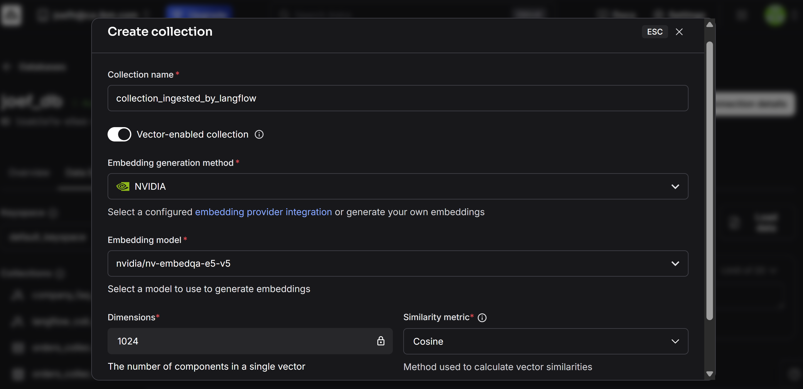

# How to use LangFlow to ingest data into Astra DB to be used as the knowledge source of Agent Knowledge 
This document explains how to use LangFlow to ingest data into Astra DB, to be used as the knowledge source of Agent Knowledge.

## Before you begin
1. Sign up for Astra DB
    * To sign up for Astra DB, see [Sign up for Astra DB](https://astra.datastax.com/)  
2. Get access to LangFlow
    * To install LangFlow Desktop, see [Install LangFlow Desktop](https://www.langflow.org/desktop)
    * To sign up for managed LangFlow, see [Sign up for managed LangFlow](https://astra.datastax.com/langflow)

## Table of contents
* [Step 1: Prepare Astra DB and collect the connection information](#step-1-prepare-astra-db-and-collect-the-connection-information)
  * [Prepare Astra DB](#prepare-astra-db)
  * [Collect the connection information](#collect-the-connection-information)
* [Step 2: Use LangFlow to ingest data into Astra DB](#step-2-use-langflow-to-ingest-data-into-astra-db)
  * [Add the Astra DB component](#add-the-astra-db-component)
  * [Add other components](#add-other-components)
  * [Connect the components and run the ingestion](#connect-the-components-and-run-the-ingestion)
* [Step 3: Connect to Agent Knowledge in watsonx Orchestrate](#step-3-connect-to-agent-knowledge-in-watsonx-orchestrate)

## Step 1: Prepare Astra DB and collect the connection information
### Prepare Astra DB
1. Login to Astra DB
2. Create a new database, or select an existing database
3. Go to `Data Explorer` tab > `Collections and Tables` drop down, select `Create collection`
4. Enter `Collection name`, toggle on `Vector-enabled collection`, select `Embedding generation method`, `Embedding model`, `Dimension`, `Similarity metric`, click `Create collection`

### Collect the connection information
#### Token
1. Login to Astra DB
2. On the upper right of the portal, click `Settings` > `Tokens`
3. Choose `Role`, `Description`, `Expiration`, and click on `Generate token`
4. Take a note of the generated token 

#### Database name and collection name
Take a note of the database name and the collection name as used in the `Prepare Astra DB` section.

## Step 2: Use LangFlow to ingest data into Astra DB
You can ingest data into Milvus vector database either through watsonx.ai or by using custom code.
### Add the `Astra DB` component
1. Launch LangFlow and create a project
2. In `Components` > `Vector Stores`, drag and drop `Astra DB` to the canvas
3. In the `Astra DB` component, fill in `Astra DB Application Token`
4. Select `Database` and `Collection` as used in `Step 1`

### Add other components
1. In `Components` > `Data`, drag and drop `File` to the canvas, and choose the file(s) to upload
2. In `Components` > `Processing`, drag and drop `Split text` to the canvas, and enter `Chunk Overlap` and `Chunk Size`
3. In `Components` > `Outputs`, drag and drop `Chat Output` to the canvas

### Connect the components and run the ingestion
1. Connect all the components as shown in the screen capture below
2. Click `Playground` > `Run Flow` to ingest the data

**NOTE: By default, `_id` and `$vectorize` are the two main fields created in the Astra DB collection schema. When setting up Milvus as content repository in Agent Knowledge, you must configure the `Title` and `Body` fields with these two fields.**

## Step 3: Connect to Agent Knowledge in watsonx Orchestrate

This option allows you to integrate with your Astra DB service through the Agent Knowledge feature of watsonx Orchestrate.

For detailed instructions on setting up Astra DB through the Agent Knowledge feature of watsonx Orchestrate, see [Connecting to an Astra DB content repository](https://www.ibm.com/docs/en/watsonx/watson-orchestrate/base?topic=agents-connecting-astra-db-content-repository).

