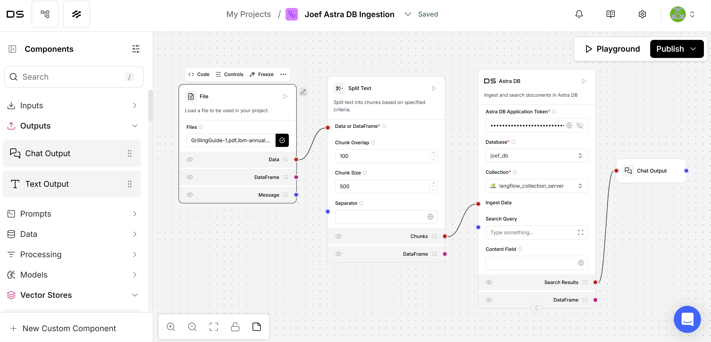

# How to use LangFlow to ingest data into Astra DB to be used as the knowledge source of Agent Knowledge 
This document explains how to use LangFlow to ingest data into Astra DB, which can then be used as a knowledge source in Agent Knowledge.

## Before you begin
Before starting the ingestion process, ensure you have access to both Astra DB and LangFlow. This section provides links to sign up or install the necessary tools.

1. Sign up for Astra DB
    * To sign up for Astra DB, see [Sign up for Astra DB](https://astra.datastax.com/)  
2. Get access to LangFlow
    * To install the desktop version: [Install LangFlow Desktop](https://www.langflow.org/desktop)
    * To use the managed version: [Sign up for managed LangFlow](https://astra.datastax.com/langflow)

## Table of contents
* [Step 1: Prepare Astra DB and collect connection information](#step-1-prepare-astra-db-and-collect-connection-information)
  * [Prepare Astra DB](#prepare-astra-db)
  * [Collect connection information](#collect-connection-information)
* [Step 2: Ingest Data into Astra DB using LangFlow](#step-2-ingest-data-into-astra-db-using-langflow)
  * [Add the Astra DB component](#add-the-astra-db-component)
  * [Add other components](#add-other-components)
  * [Connect components and run ingestion](#connect-components-and-run-ingestion)
* [Step 3: Connect to Agent Knowledge in watsonx Orchestrate](#step-3-connect-to-agent-knowledge-in-watsonx-orchestrate)

## Step 1: Prepare Astra DB and collect connection information
To ingest data into Astra DB, you first need to set up your database and collection, and gather the necessary credentials.

### Prepare Astra DB
1. Login to Astra DB.
2. Create a new database, or select an existing database.
3. Go to the `Data Explorer` tab > `Collections and Tables` > `Create collection`.
4. Enter the `Collection name`, enable `Vector-enabled collection`, and configure `Embedding generation method`, `Embedding model`, `Dimension`, `Similarity metric`, click `Create collection`.

### Collect connection information
#### Token
1. Login to Astra DB.
2. Go to `Settings` > `Tokens` on the top-right corner.
3. Choose `Role`, `Description`, `Expiration`, and click on `Generate token`.
4. Save the generated token securely.

#### Database name and collection name
Take a note of the database name and the collection name as used in the `Prepare Astra DB` section.

## Step 2: Ingest Data into Astra DB using LangFlow
You can ingest data into Milvus vector database either through watsonx.ai or by using custom code.
### Add the `Astra DB` component
1. Launch LangFlow and create a new project.
2. Under `Components` > `Vector Stores`, drag and drop the `Astra DB` component onto the canvas.
3. Enter your `Astra DB Application Token`.
4. Select the `Database` and `Collection` from `Step 1`.

### Add other components
1. In `Components` > `Data`, add the `File` component and upload your file(s).
2. In `Components` > `Processing`, add the `Split text` component, and enter `Chunk Overlap` and `Chunk Size`.
3. In `Components` > `Outputs`, add the `Chat Output` component.

### Connect components and run ingestion
1. Connect all the components as shown in the screen capture below.
2. Click `Playground` > `Run Flow` to ingest the data.

**NOTE: By default, `_id` and `$vectorize` are the two main fields created in the Astra DB collection schema. When setting up Astra DB as content repository in Agent Knowledge, you must configure the `Title` and `Body` fields with these two fields.**

## Step 3: Connect to Agent Knowledge in watsonx Orchestrate

After ingestion, you can integrate Astra DB with Agent Knowledge in watsonx Orchestrate. This section points you to the official documentation for completing the connection setup.

For detailed instructions on setting up Astra DB through the Agent Knowledge feature of watsonx Orchestrate, see [Connecting to an Astra DB content repository](https://www.ibm.com/docs/en/watsonx/watson-orchestrate/base?topic=agents-connecting-astra-db-content-repository).

