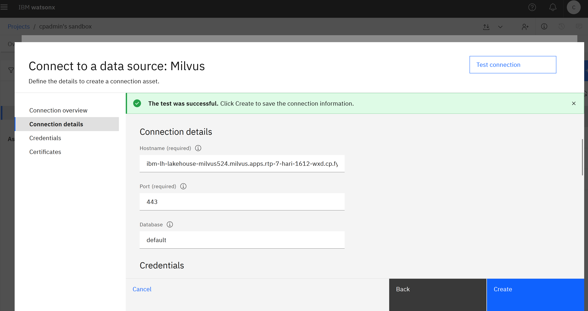
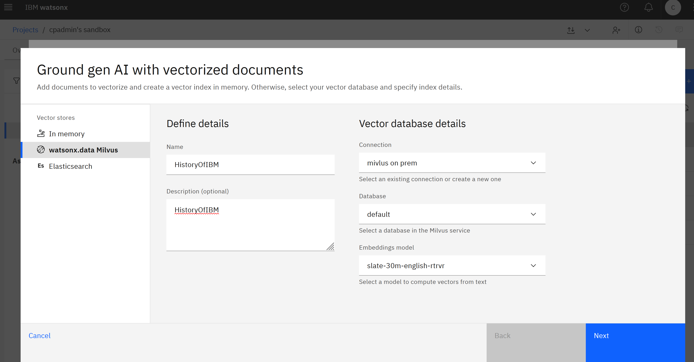
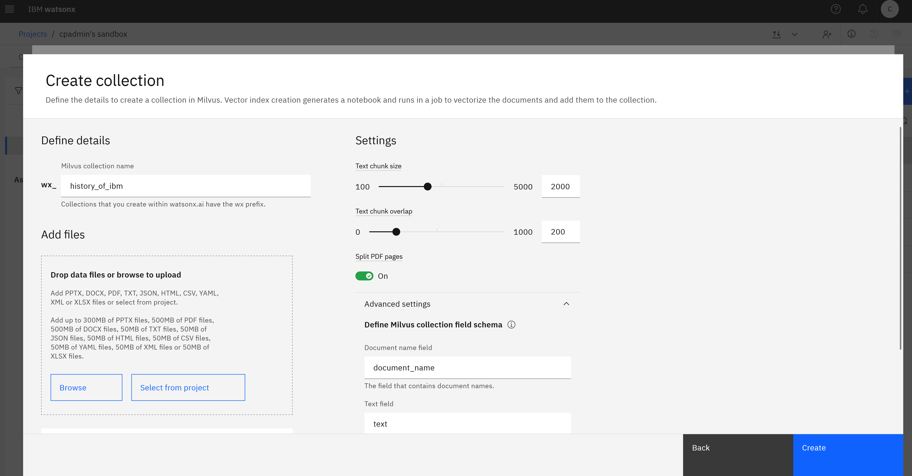

# How to set up watsonx.data Milvus Cloud Pak for Data as a content repository of Agent Knowledge in watsonx Orchestrate Cloud Pak for Data by using an embedding model in watsonx.ai Cloud Pak for Data 
This document explains how to set up watsonx.data Milvus Cloud Pak for Data as a content repository of Agent Knowledge in watsonx Orchestrate Cloud Pak for Data by using an embedding model in watsonx.ai Cloud Pak for Data.

## Before you begin
1. Provision a watsonx.data instance
    * To install and set up watsonx.data on Cloud Pak for Data (on-prem), see [Installing and administering Cloud Pak for Data](https://www.ibm.com/docs/en/cloud-paks/cp-data/5.2.x?topic=installing-administering-cloud-pak-data)  
2. Add a Milvus service in the watsonx.data console
    * To add a Milvus service on Cloud Pak for Data (on-prem), see [Adding a Milvus service](https://www.ibm.com/docs/en/watsonxdata/standard/2.2.x?topic=milvus-adding-service)
3. This guide focuses on how to set up watsonx.data Milvus on Cloud Pak for Data as the content repository. For instructions on configuring watsonx.ai and watsonx Orchestrate on Cloud Pak for Data, refer to their respective documentation.

## Table of contents
* [Step 1: Collect Milvus connection information](#step-1-collect-milvus-connection-information)
  * [Get the credentials](#get-the-credentials)
  * [Get other connection details](#get-other-connection-details)
* [Step 2: Ingest data into Milvus](#step-2-ingest-data-into-milvus)
  * [Option 1: Ingest data through watsonx.ai](#option-1-ingest-data-through-watsonxai)
  * [Option 2: Ingest data using custom code](#option-2-ingest-data-using-custom-code)
* [Step 3: Connect to Agent Knowledge in watsonx Orchestrate](#step-3-connect-to-agent-knowledge-in-watsonx-orchestrate)

## Step 1: Collect Milvus connection information
### Get the credentials
#### Username
The default username is `cpadmin` for the Milvus service on watsonx.data. You can also find the username in the Milvus "Access control" panel in the `Infrastructure Manager` of the watsonx.data instance.

#### Password
Use the password that you created for `cpadmin` or a different user that has the access to the Milvus service as identified in the `Infrastructure Manager`.

### Get other connection details
Apply the following steps to collect additional Milvus connection details from the watsonx.data console:

1. Go to the `Infrastructure manager` page.
2. Click the Milvus service to open the `Details` page.
3. Click on `View connect details` to view more connection details.
4. Collect the GRPC `host`, `port`, and the SSL certificate from the service details.

## Step 2: Ingest data into Milvus
You can ingest data into Milvus vector database either through watsonx.ai or by using custom code.
### Option 1: Ingest data through watsonx.ai
#### Create a Milvus connection
On the watsonx.ai Project Assets page, click on `New asset` > choose `Connect a data source` > choose `Milvus` > click `Next` > fill in the connection details and credentials as below > `Test connection` > click `Create`.



#### Create a vector index and upload documents
On the Watsonx.ai Project Assets page, use the Milvus connection configured in the previous step to create a vector index and upload documents. Do the following steps:
1. On the watsonx.ai Project Assets page, click on `New asset` > choose `Ground gen AI with vectorized documents`.
2. On the left-side panel, select `watsonx.data Milvus` as the vector store > fill in name and description > select the Milvus connection created earlier. 
3. Select the Milvus connection created earlier > Select `Database` and `Embeddings model` from the dropdowns > click `Next`. For example,  


4. Click `New collection` to create a new collection.
5. Enter a unique collection name, select the files to include in the Milvus collection, and then click `Create`. Note the values for the `Document name` and the `Text` under `Advanced settings`, for later use during Agent Knowledge setup. 


6. Once the document upload is complete, you can start testing it in the prompt lab.

**NOTE: By default, `document_name` and `text` are the two main fields created in the Milvus collection schema. When searching this Milvus collection using custom code, you must specify these two fields as `output_fields`. When setting up Milvus as content repository in Agent Knowledge, you must configure the `Title` and `Body` fields with these two fields.**

### Option 2: Ingest data using custom code
To ingest documents into Milvus, refer to the sample code: [../examples/index-with-milvus.py](../examples/index-with-milvus.py). To run the code, 
1. Install dependencies.
   ```bash
   python3 -m pip install pymilvus langchain langchain-milvus langchain-ibm ibm-watsonx-ai PyPDF2
   ```
2. Create environment variables for Milvus credentials.
  ```bash
  export MILVUS_HOST="Your Milvus GRPC host"
  export MILVUS_PORT="Your Milvus GRPC port"
  export MILVUS_USER="cpadmin" // The default username for watsonx.data Milvus on-prem
  export MILVUS_PASSWORD="Your watsonx.data Milvus on-prem password"
  export MILVUS_PEM_PATH="the file path to the watsonx.data Milvus on-prem TLS certificate"
  export MILVUS_COLLECTION_NAME="Your Milvus collection name" // It can be anything

  export WATSONX_AI_URL="Your watsonx.ai on-prem URL"
  export WATSONX_AI_USERNAME="Your watsonx.ai on-prem username" // watsonx.ai embeddings model is used to create vectors
  export WATSONX_AI_PASSWORD="Your watsonx.ai on-prem password" // watsonx.ai embeddings model is used to create vectors
  export WATSONX_AI_PROJECT_ID="Your watsonx.ai project ID" // watsonx.ai project ID is required to access the embeddings models
  ```
3. Update the `SOURCE_FILES`, `SOURCE_URLS`, and `SOURCE_TITLES` variables at the beginning of the script to your file names, urls, and titles respectively.
4. Run the script.
   ```bash
   python3 index-with-milvus.py
   ```

## Step 3: Connect to Agent Knowledge in watsonx Orchestrate

**NOTE: The embedding model used for search in [Step 3](#step-3-connect-to-agent-knowledge-in-watsonx-orchestrate) must align with the embedding model used for data ingestion in [Step 2](#step-2-ingest-data-into-milvus).**

This option allows you to integrate with your watsonx.data Milvus on-prem service through the Agent Knowledge feature of watsonx Orchestrate.

For detailed instructions on setting up watsonx.data Milvus (on-prem) through the Agent Knowledge feature of watsonx Orchestrate, see [Connecting to a Milvus content repository](https://www.ibm.com/docs/en/watsonx/watson-orchestrate/base?topic=agents-connecting-milvus-content-repository).

