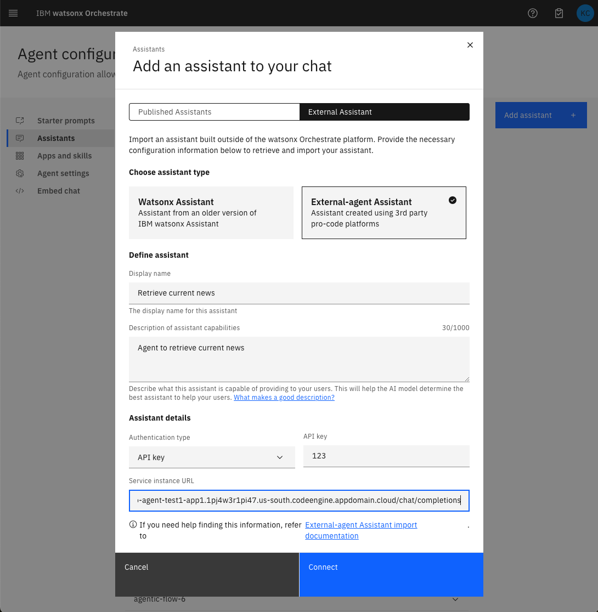
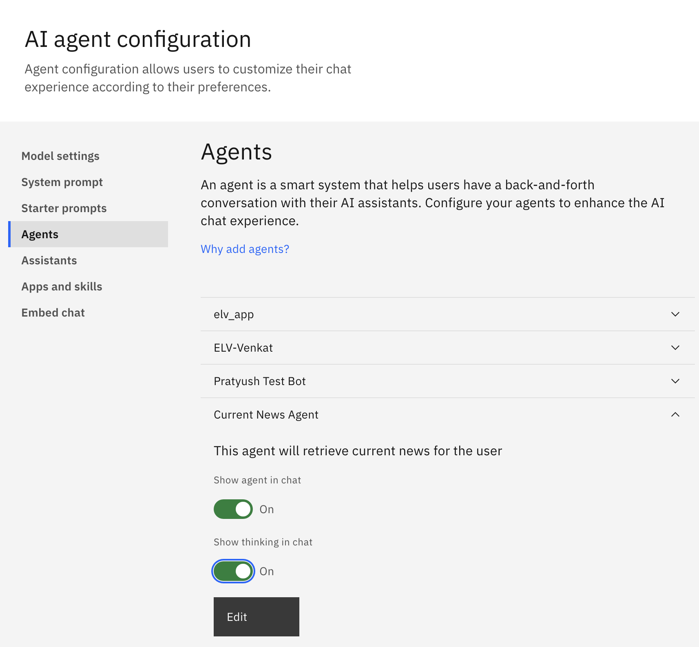
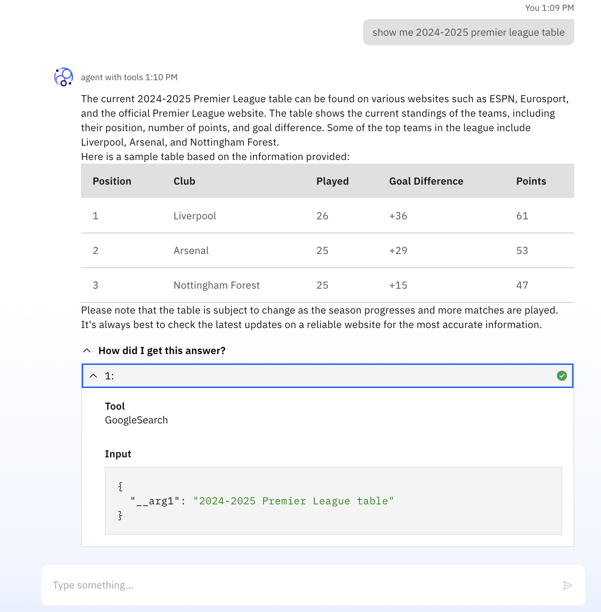

# IBM Watsonx Orchestrate - External Agent Example

Use these examples to kick-start your external agent development.

For official feature documentation, refer to the [IBM Developer API Catalog](https://developer.ibm.com/apis/catalog/watsonorchestrate--custom-assistants/api/API--watsonorchestrate--ibm-watsonx-orchestrate-api#Register_an_external_chat_completions_agent__agents_external_chat_post).

🚨 See "wx_ai_external_agent_registration" to integrate "watsonx.ai" Agent with watsonx Orchestrate natively using the API. 🚨

## Overview

This example demonstrates how to deploy an external agent as an AI service in IBM watsonx.ai. The application leverages 
FastAPI and [IBM watsonx.ai AI Service](https://www.ibm.com/products/watsonx-ai/ai-agent-development) to create a chat completion service that integrates with IBM watsonx models. It also includes AI tools for Google search and Python interpreter.

To provide more background, IBM watsonx.ai AI Services is an upcoming feature for deploying custom agentic services and applications. Related to this, IBM watsonx.ai Agent Builder is another upcoming feature for building agents within a visual interface. This example guides you step by step to create an AI service using Agent builder, then deploy a Code Engine application that implements the watsonx Orchestrate external agent [`/chat/completions` endpoint](https://github.com/watson-developer-cloud/watsonx-orchestrate-developer-toolkit/blob/main/external_agent/spec.yaml) using the `ai_service` and `ai_service_stream` endpoints exposed by your AI service, and finally register it as an external agent in watsonx Orchestrate.

Alternative to Agent Builder, you can also build a more customized agentic AI service in a more programmatic manner by using the [IBM watsonx.ai SDK](https://ibm.github.io/watsonx-ai-python-sdk/core_api.html#client.Deployments.create). Please refer to this [application template](https://github.com/IBM/watson-machine-learning-samples/tree/master/cloud/ai-service-templates/langgraph-react-agent) for more detail.

## Change log

- 2025/03/27:
  - See recommended approach in "wx_ai_external_agent_registration" folder to integrate "watsonx.ai" Agent with watsonx Orchestrate natively using the API.
- 2025/03/12:
  - The wrapper code in this example has been updated to resolve a problem using the latest response schema of the watsonx.ai Agent Lab when using the AI service `run_ai_service_stream` API
- 2025/02/20: 
  - the wrapper code in this example has been updated to work with the latest response schema of watsonx.ai Agent Builder; if you are having trouble with an old AI service deployed on watsonx.ai, you might need to rebuild the agent in watsonx.ai Agent Builder and re-deploy it as a new AI service;
  - this example has been updated to work with CoT rendering in AI chat UI;
  - simplification of authentication: space id is no longer required;

## Disclaimer

IBM watsonx.ai AI services and Agent Builder are two upcoming features scheduled for release as of writing this. Please follow the official [homepage](https://www.ibm.com/products/watsonx-ai/ai-agent-development) for release announcement. This example is subject to changes.

## Features

- **Chat Completion Service**: The application provides a RESTful API endpoint for chat completions, supporting both synchronous and streaming responses following the specification of IBM Orchestrate external agents.
- **Integration with AI Models**: By utilizing IBM watsonx.ai, different LLMs can be chosen to back the agent application.
- **Tool Integration**: The application includes tools for Google search and Python interpreter, which can be invoked during chat interactions.
- **Token Management**: Implements a caching mechanism for IBM Cloud IAM tokens to optimize authentication processes.
- **Logging and Debugging**: Logging is set up to facilitate debugging and monitoring of the application.

## Security Limitations

Please be aware that this example accepts any API Key or Bearer token for authentication. 
It is recommended to implement your own authentication security measures to ensure proper security.

## Deployment Instructions

### Step 0: Create an AI deployment on IBM watsonx.ai

- Login to watsonx.ai and enter Agent Lab

- Configure an Agent Builder template

- Deploy as an AI service by clicking the "Deploy" icon in the top right corner
- Make a note of the deployment id and your IBM cloud API key
  - The deployment id can be found as part of the API endpoints generated in the "API reference" tab in your deployment page (opened by clicking the name of your deployment in the "Deployments" tab in your deployment space page)

  - Your IBM cloud API key can be obtained following [documentation](https://cloud.ibm.com/docs/account?topic=account-userapikey&interface=ui)

### Step 1: Create a Code Engine Project

1. **Using IBM Cloud Web UI:**
   - Navigate to [IBM Cloud Code Engine Projects](https://cloud.ibm.com/containers/serverless/projects) and select **Create**. Name your project, for instance `wxo-agent-test1`.
   - Select the agent you created (`wxo-agent-test1`) and choose the **Application** menu item from the left navigation panel.

2. **Create an API Key for Registry Secret:**
   - Select **Manage** from the title bar menu and go to **Access (IAM)**.
   - From the left navigation menu, select **API keys**.
   - Click **Create** and copy the new API key for use in the registry secret.

3. **Create the Code Engine Application:**
   - Click the **Create** button to start creating an application.
   - Under **Code**, select **Build container image from source code**.
   - In the **Code repo URL** field, enter `https://github.com/watson-developer-cloud/watsonx-orchestrate-developer-toolkit`.
   - Click **Specify build details**:
     - **SSH secret:** None
     - **Branch name:** main
     - **Context directory:** `external_agent/examples/agent_builder`
     - Click **Next**
     - **Dockerfile:** Dockerfile (leave default)
     - Click **Next**
     - Under **Registry secret**, create a secret (if one doesn't exist) using the **API Key** created above
   - **Application name:** Any name, for instance `wxo-agent-test1-app1`
   - **Domain mappings:** Public
   - Alternatively, you can build the image locally after cloning the repo and provide the docker image to Code Engine

4. **Set Environment Variables:**
   - Add the following environment variables:
     - `WATSONX_DEPLOYMENT_ID`
     - `WATSONX_API_KEY`
     - `WATSONX_URL` (optional)

5. **Test the Application:**
   - Choose **Test application** and click **Application URL**.
   - Append `/docs` to the end of the URL path to view a formatted API page.
     - Example: `https://wxo-agent-test1-app1.1pj4w3r1pi47.us-south.codeengine.appdomain.cloud/docs`

### Step 2: Register the New Endpoint as an External Agent

1. **In IBM watsonx orchestrate Web UI:**
   - From the top left hamburger menu, select **AI agent Configuration**.
   - Select **Agents** from the left-hand navigation.
   - Click the **Add agent** button on the top right.

2. **Enter Details:**
   - **Display Name:** e.g., agent that can search and code
   - **Description:** Enter a description of capabilities, for instance `Retrieve latest news and solving coding problem`
   - **API Key:** Enter your API key.
   - **Service Instance URL:** Use the Test URL with `/chat/completions` appended.
     - Example: `https://wxo-agent-test1-app1.1pj4w3r1pi47.us-south.codeengine.appdomain.cloud/chat/completions`

3. **CoT rendering (Optional)**
   - After you register your agent, you can enable CoT render in **AI agent Configuration** page, under **Agents** tab, click the name of your agent and toggle the option **Show thinking in chat**

### Step 3: Call the new External Agent from Orchestrate

1. **In IBM watsonx orchestrate Web UI:**
   - Select **Chat** from the left-hand navigation.
   - Type a question that should route to the new agent, like `show me 2024-2025 premier league table`
   - The results from the external agent should be streamed to the IBM watsonx Orchestrate chat window
   - In the screenshot below, the conversation shows how the agent uses Google search tool to answer a question. 

