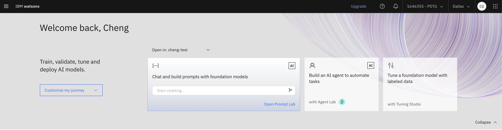
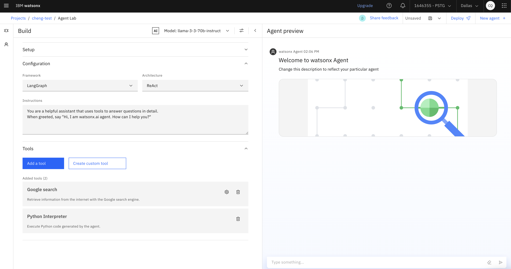
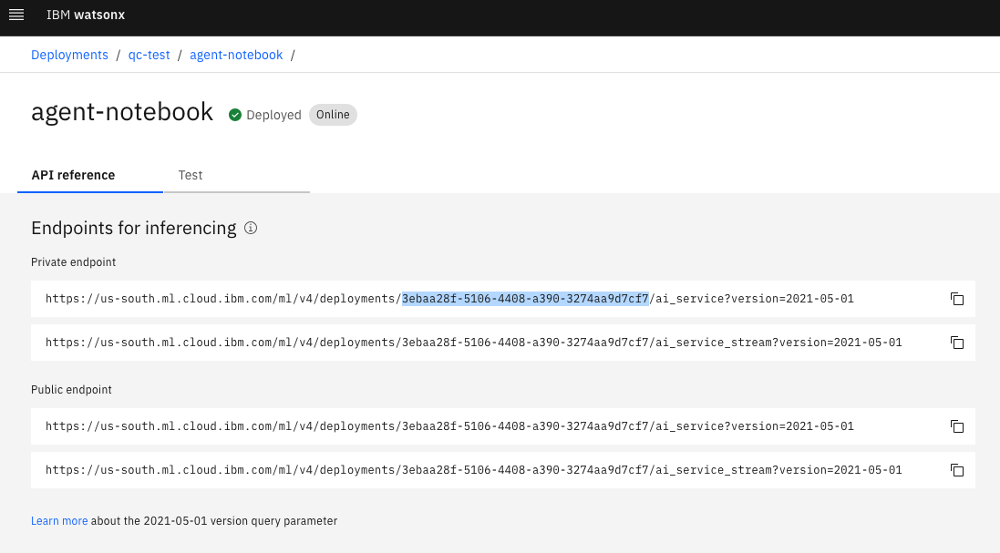
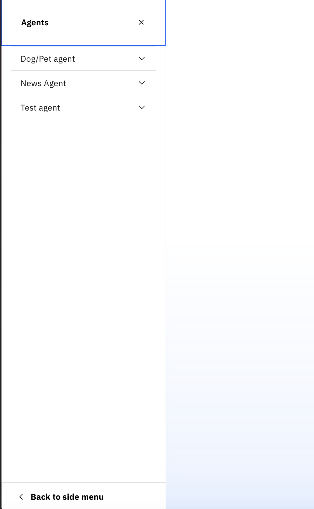
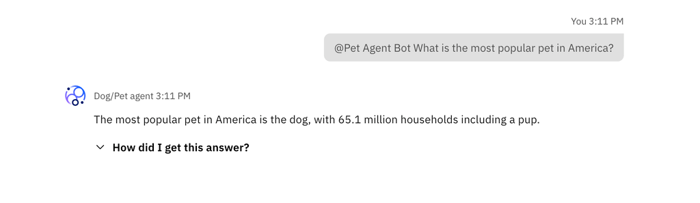

# IBM Watsonx Orchestrate - External Agent Example

Use these examples to kick-start your external agent development.

IBM watsonx.ai AI Services is an upcoming feature for deploying custom agentic services and applications. IBM watsonx.ai Agent Builder is another upcoming feature for building agents within a visual interface. This example guides you step by step to create an AI service using Agent builder, and then natively register the watsonx.ai agent in watsonx Orchestrate.

## Disclaimer

IBM watsonx.ai AI services and Agent Builder are two upcoming features scheduled for release as of writing this. Please follow the official [homepage](https://www.ibm.com/products/watsonx-ai/ai-agent-development) for release announcement. This example is subject to changes.

## Wait... how is different than [this](https://github.com/watson-developer-cloud/watsonx-orchestrate-developer-toolkit/blob/main/external_agent/examples/agent_builder/README.md)?

In `external_agent/examples/agent` you need to deploy a custom solution to interface your `watsonx.ai` Agent and watsonx Orchestrate. Now, you can register your `watsonx.ai` Agent directly into watsonx Orchestrate.

**You will still need to deploy your `watsonx.ai` Agent as an AI Service**. The steps on how to do that are below.


## Instructions

### Step 0: Create an AI deployment on IBM watsonx.ai

- Login to watsonx.ai and enter Agent Lab

- Configure an Agent Builder template

- Deploy as an AI service by clicking the "Deploy" icon in the top right corner

- Copy the **streaming Public endpoint** and make note of the API Key.
  - The streaming public endpoint has `ai_service_stream` as part of the URL

  - Your IBM cloud API key can be obtained following [documentation](https://cloud.ibm.com/docs/account?topic=account-userapikey&interface=ui)

### Step 1: Register watsonx.ai with WatsonX Orchestrate
To register your watsonx.ai Agent with watsonx Orchestrate, use the [`external-chat endpoint`](https://developer.ibm.com/apis/catalog/watsonorchestrate--custom-assistants/api/API--watsonorchestrate--ibm-watsonx-orchestrate-api#Register_an_external_chat_completions_agent__agents_external_chat_post).

**Set: <br>**
- `auth_token` field to watsonx.ai API Key
- `auth_scheme` field to `"API_KEY"`
- `provider` field to to `"wx.ai"`

This is what an example payload looks like:
```
{
"title": "Pet Agent Bot",
  "description": "wx.ai agent",
  "tags": [
    "agent_lab"
  ],
  "name": "Dog/Pet agent",
  "api_url": "<wx.ai streaming public inference api url>",
  "auth_scheme": "API_KEY",
  "auth_config": {
    "token": "<wx.ai API key>"
  },
  "chat_params": {},
  "instructions": "You are an agent that answers questions about the Pets. Things like most common pets in America, tips about being responsible pet owners. For questions about dog ownership, you can provide reccomendations for the best dog based on the persons lifestyle, dog training tips, and things to do with your dog. Keep response as brief as possible.",
  "config": {
    "hidden": false,
    "enable_cot": true
  },
  "nickname": "Pet Agent",
  "provider": "wx.ai"
}
```

This is what an example CURL command looks like:
```bash
curl --request POST \
  --url <Wxo instance>/v1/orchestrate/agents/external-chat \
  --header 'accept: application/json' \
  --header 'authorization: Bearer <token for wxo tenant>' \
  --header 'content-type: application/json' \
  --data {
  "title": "Pet Agent Bot",
  "description": "wx.ai agent",
  "tags": [
    "agent_lab"
  ],
  "name": "Dog/Pet agent",
  "api_url": "<wx.ai streaming public inference api url>",
  "auth_scheme": "API_KEY",
  "auth_config": {
    "token": "<wx.ai API key>"
  },
  "chat_params": {},
  "instructions": "You are an agent that answers questions about the Pets. Things like most common pets in America, tips about being responsible pet owners. For questions about dog ownership, you can provide reccomendations for the best dog based on the persons lifestyle, dog training tips, and things to do with your dog. Keep response as brief as possible.",
  "config": {
    "hidden": false,
    "enable_cot": true
  },
  "nickname": "Pet Agent",
  "provider": "wx.ai"
}
```

### Step 2 Verify Successful Registration
Navigate to the UI, in the sidepanel, under "Agents", you will see your newly registered "watsonx.ai" Agent



### Step 3 Conversing With Agent

For testing, use the `@Agent Name` feature in the UI to call the registered external agent.



